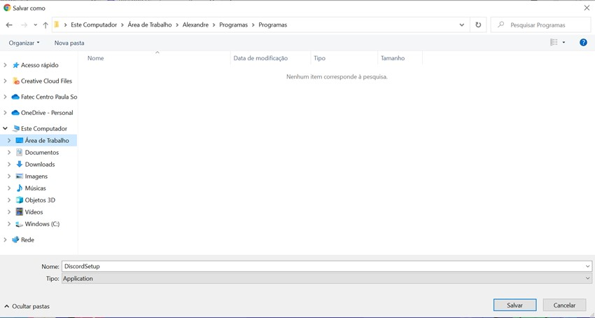
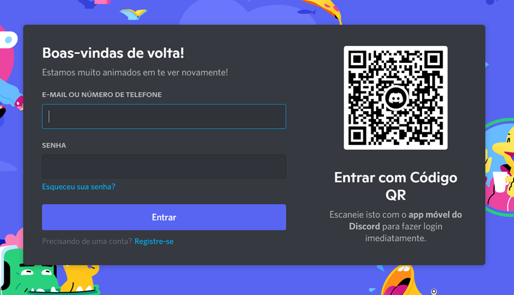
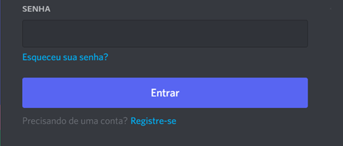
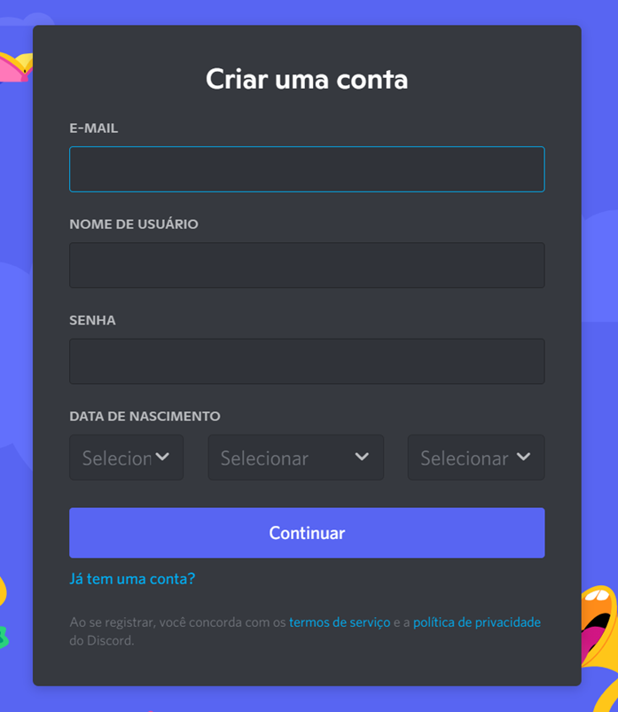
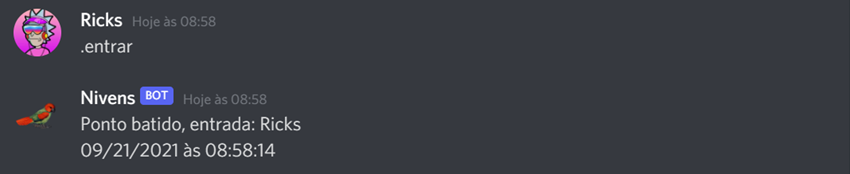
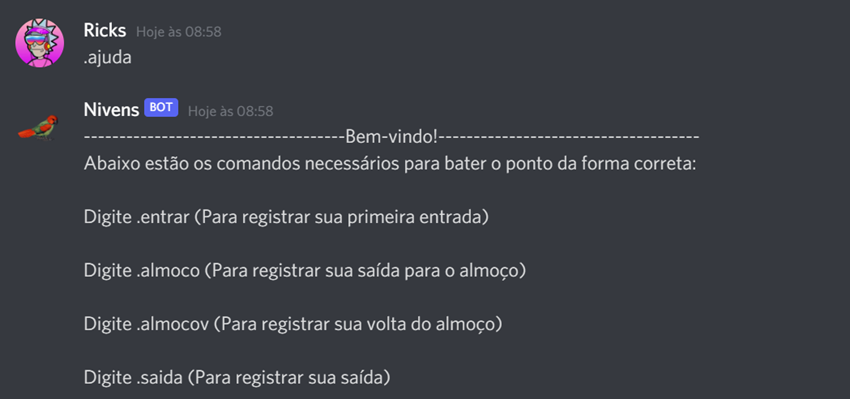

# Tutorial de uso do bot 
## **Requisitos Mínimos para utilização do Discord**

A aplicação desktop está disponível para Windows 7 ou mais atual e Mac OS 10.10 ou mais atual.

Dispositivos iOS devem estar atualizados com a versão iOS 10.0 ou mais atual.

Dispositivos Android devem estar atualizados com a versão 5.0 ou mais atual.

Discord funcionará no Google Chrome, Firefox 38+, Opera, Microsoft Edge 17+ (incluindo Chromium Edge 79+ no Windows e macOS), Safari 11+ (Disponível no macOS 10.13 High Sierra e acima). 

Por favor tenha em mente que versões antigas de navegadores podem não apresentar algumas funcionalidades conforme novos recursos são lançados, e o chat de voz para o Firefox só é suportado em versões 59 ou superiores.
***********
## **Resumo das funcionalidades do BOT**

O BOT Nivens tem como principal funcionalidade o registro de horas através do sistema Discord, visa facilitar a marcação de ponto dos funcionários já que o BOT está integrado a uma das ferramentas utilizadas no dia a dia pela empresa. 
************

## **Instalação e Utilização do Discord/Bot**

### **Etapa 1 (Instalação de Programa): Discord**

Baixe e instale o Discord.

Pode ser feito acessando o link: https://discord.com/ .

Após o download, siga as instruções de instalação do software. Ou siga o tutorial abaixo:

1. Escolha o local onde deseja salvar o programa Discord e clique em salvar.

2. Clique duas vezes para abrir o programa Discord.

3. Após a inicialização do programa, entre com seu e-mail e senha para fazer login ou escaneie o código QR utilizando o aplicativo Discord para dispositivos móveis.

4. Caso não possua uma conta, clique em Registre-se.

5. Insira seus dados para criar uma conta nova e depois conclua o processo clicando em Continuar.

*************

## **Etapa 2: Canal Empresarial**

Sua empresa encaminhará um link por e-mail convidando-o para participar de um dos canais disponíveis no Discord. Basta clicar no link e você será direcionado para o APP.

*************

## **Etapa 3 (Utilização do Sistema no Discord): Utilizando o Bot**

Para utilizar o BOT no chat do Discord, basta digitar “.” (ponto) seguido de um dos comandos disponíveis. (Ex: .almoco). Assim que o comando for acionado, seu horário de entrada ou saída será registrado

Para ver a lista completa de comandos disponíveis, digite “.ajuda”.

**********

## **Lista de comandos**

- **.entrar**: Registra a primeira entrada do dia;
- **.almoco**: Registra saída para o almoço;
- **.almocov**: Registra o retorno almoço;
- **.saida**: Registra sua saída do expediente.
- **.ajuda**: Exibe a lista de comandos possíveis do bot.

*********
